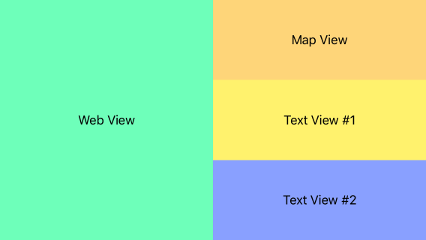

# AutoLayoutTraits

Basic example using Size Classes / Traits with AutoLayout Constraints to re-position and re-size views (and other objects) based on screen traits - such as rotating from Portrait to Landscape orientation.

Xcode 8 - Swift 3 (although nothing is done in code - just used the Swift 3 Single View App template)

<table>
    <tr>
        <td></td>
        <td></td>
    </tr>
</table>

